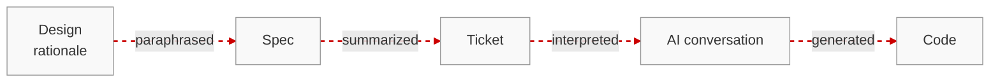
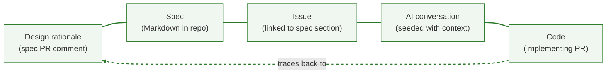

+++
title = "Context Loss in AI-Assisted Development"
date = 2026-02-16T08:00:00-08:00
draft = false
description = "AI accelerates code output but amplifies the oldest problem in software: losing the why behind decisions."
tags = ["ai", "developer-workflows", "engineering"]
mermaid = true
+++

I pair with AI every day. It writes code, suggests architectures and regularly catches bugs I would have shipped. While the productivity gain is real, after months of this workflow, I've noticed something that concerns me more than any hallucination or wrong import: both human and AI context evaporates rapidly between conversations.

## Pre-existing fragmentation

Consider what happens on a typical software development team. A product manager writes a spec in a Google Doc. Engineers discuss trade-offs in a Google Doc or Slack thread and eventually a decision is made in a call.

_(Often this cycle will repeat itself as engineers draft technical designs based on the original product spec)_

By the time the document is approved, someone opens several tickets that paraphrases the spec. By the time a developer picks up the ticket, the rationale behind the feature is scattered across multiple tools and weeks of back-and-forth. The why (why this approach was chosen? What alternatives were rejected? Which stakeholder cares about which edge case?) is effectively lost.

To be clear, this isn't a new problem. Software teams have previously struggled to maintain traceability between intent and implementation, and so to they struggle with it now in the age of AI. But the friction of writing code by hand used to act as a natural check. When a developer sat down to implement a feature, the work itself forced a kind of reckoning with the requirements. Ambiguities that looked fine in a spec became obvious when you had to translate them into control flow. Missing edge cases surfaced when you wrote the conditional logic. A vague acceptance criterion that read well in a ticket would stall you for an hour while you figured out what it actually meant. That friction was slow and often frustrating, but it served a purpose: it created repeated moments where developers had to re-engage with the reasoning behind what they were building, and those moments caught misalignments early.

## Compression of the feedback loop

AI removes that friction, and with it, the check. A coding assistant doesn't stall on ambiguity, rather it fills gaps with plausible defaults and keeps moving. You can describe a feature in two sentences, get working code in minutes, and ship it before anyone realizes the output doesn't match the original intent. The feedback loop that used to surface misalignment - that slow, forced confrontation with unclear requirements - gets compressed into nothing.

Moreover, each new AI conversation compounds the problem. Every session starts without the prior thread's context - without the decisions, constraints, and trade-offs that shaped the work so far. The distance between "why we decided to build this" and "what actually got built" widens at every handoff: tool to tool, person to person, conversation to conversation.

## Toward closing the traceability gap

I've started thinking about this as a traceability gap — the distance between the original intent behind a decision and what actually gets built. Every lossy handoff in the diagram above widens it. I believe that most teams already have a tool that could close it: GitHub. 

Github already hosts the code, the pull requests, the issues, and the review discussions. The primitives for an unbroken chain from rationale to implementation are all there. They're just not connected to the earlier stages of the process (specs, design decisions, and trade-off discussions that happen before a single line of code is written).

Imagine a workflow where:
1. Specs could live as Markdown in the repo, reviewed through pull requests just like code. 
2. Decisions could be captured as PR comments, linked to the exact section of the spec they address. 
3. Issues could trace back to the spec section that spawned them. 

When a feature ships, you could follow a single chain from the merged PR back through the implementing issue, back through the approved spec, back to the original design rationale.

But today, this doesn't happen - GitHub's review surface is built for code, not for product thinking. Non-engineering stakeholders won't review a raw Markdown diff. This tooling gap pushes specs back into Google Docs; decisions back into Slack, and the traceability chain breaks before it ever forms.

The harder question for teams adopting AI-assisted development is not how to generate code faster, but how to preserve the intent behind that code across every handoff - human to human, human to AI, spec to ticket to branch to merge. Until the tooling catches up, the traceability gap will continue to widen, and the cost will show up not in slower output, but in software that drifts further from what was actually meant.
